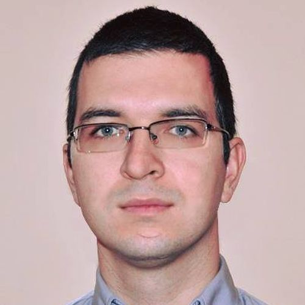

[Meetup](https://www.meetup.com/%C5%9Al%C4%85ska-Grupa-Microsoft-Meetup/events/254067611/)

## **Marcin Tyborowski**

**Query Execution Plan - lets analyze something**  
Podczas prezentacji pokaze czym sa plany zapytan w SQL Server, przedstawie jak je analizowac oraz przedstawie kilka prostych sposobów na zoptymalizowanie naszej bazy danych. Prezentacja ma na celu pokazac co skrywaja przed nami nasze zapytania, oraz uswiadomic, ze na LINQ i Entity Framework swiat sie nie konczy, a wybór tych rozwiazan w pewnym momencie rozwoju projektu jest strzalem w kolano.  

 

O mnie:  
Marcin Tyborowski, student 3 roku informatyki na Politechnice Bialostockiej, na co dzien programista .NET w Elastic Cloud Solutions.  
Otwarty na nowe technologie, aktywny w spolecznosciach, przewodniczacy kola .NET PB, prywatnie zapalony skateboardowiec oraz fan dobrych ksiazek i filmów.  

## Kacper Swislocki

**Azure Search, czyli zaawansowana wyszukiwarka w kilku krokach**  
Prezentacja bedzie wprowadzeniem do Azure Search. Opowiem na jakiej zasadzie dziala wyszukiwanie, jakie sa mozliwosci oraz dlaczego warto jej uzywac. Pokaze jak szybko zaczac korzystac z tej uslugi oraz zaprezentuje kilka przykladów dzialan, które oferuje biblioteka Miscrosoft Azure Search.  

 

O mnie:  
Student informatyki na Politechnice Bialostockiej, programista w firmie Elastic Cloud Solutions, który w wolnych chwilach interesuje sie kosmosem oraz lubi poznawac nowe technologie.  

## Rafal Hryniewski

**ORM - the tip of an iceberg**  
Chyba juz w kazdym jezyku programowania mozemy dobierac sie do naszych cennych danych za pomoca róznego rodzaju ORMów. Faktem jest, ze narzedzia te znacznie przyspieszaja wytwarzanie oprogramowania. Jednoczesnie pozwalaja na myslenie o zawartosci naszych baz danych i operacjach na nich przez pryzmat obiektowego paradygmatu programowania, co jest o wiele latwiejsze do przelkniecia dla osób poczatkujacych. ORMy maja mnóstwo zalet. Czesto jednak idziemy na latwizne i nie schodzimy do warstwy bazy danych jesli nie jest to absolutnie koniecznie, a nawet jezeli przyjdzie co do czego, to tylko szturchamy ja odpowiednio dlugim kijem z bezpiecznej odleglosci i uciekamy czym predzej do cieplego, bezpiecznego swiatka programowania obietowego. Na tej sesji pokaze Wam, kilka róznych funkcji i ciekawostek, które oferuje nam baza danych SQL Server, a które sa czesto pomijane przez ich brak w popularnych ORMach. Pokaze Wam równiez jak stosunkowo latwo mozna skorzystac z czesci z nich w starym dobrym Entity Frameworku.  

 

O mnie:  
Za dnia pracuje .NET Developer i Team Leader w firmie Elastic Cloud Solutions. Noca walcze z glodem wiedzy i nuda jako entuzjasta chmury, bloger, prelegent i lider Bialostockiej Grupy .NET oraz Microsoft Azure User Group Polska w tym samym, pieknym miescie.  
Chwytam sie wszystkiego co nowe i swieze o ile ograniczona ilosc godzin w dobie mi na to pozwala, a czasem, by dac glowie odpoczac lubie siegnac po dobra ksiazke lub komiks  
