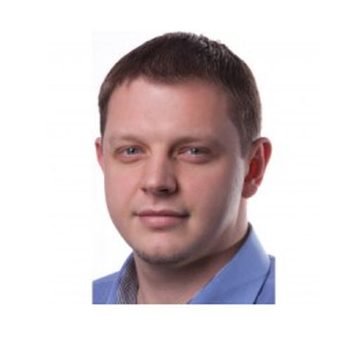
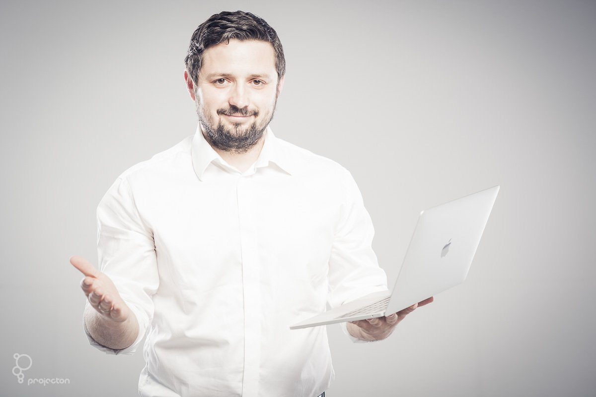

[Meetup](https://www.meetup.com/%C5%9Al%C4%85ska-Grupa-Microsoft-Meetup/events/254716111/)

## **Tomasz Pęczek**

**With great power comes great responsibility - using HTTP/2 responsibly**  
A lot has been written about new features in HTTP/2 and performance improvements it's bringing, so you have probably read some of it (don't worry if you didn't, there will be a brief recap). But we all know there is nothing for free in IT (and especially Web) world. There are no "no brainers" or "silver bullets". This talk focuses on what to consider to get the most out of HTTP/2 without hurting yourself or your users in the process.  

 

O mnie:  
Software developer and passionate Developer, blogger, speaker and open source author/contributor focused on Web Development in context of ASP.NET (Core) platform. For more than 10 years he has been creating web applications for health care, banking or e-learning industries. Currently he works in Oracle as an applications architect where his main areas of responsibility are web applications performance and security. Microsoft MVP in Visual Studio and Development Technologies category.  

## Michał Furmankiewicz

**Nie lubię buzzwordów. Chmura jest jednym z nich, tak jak serverless. W czasie godzinnej sesji, na początku wyjaśnię czym jest serverless a czym nie jest, dlaczego świat go tak lubi i co realnie można zbudować korzystając z tej koncepcji. Zobaczycie dużo demo, które pokażą przekrojowo usługi i wyjaśnią jak ich używać.  
**

 

O mnie:  
Michał od 4 lat jedyne co robi, to zabawy w chmurę. Na co dzień rozwija firmę Chmurowisko (http://chmurowisko.pl/), dba o architekturę rozwiązań i pokazuje klientom pełen świat możliwości. Lubi nowe technologie i stara się je wykorzystać w realnym biznesie. Chmurę postrzega jako narzędzie, które może pomóc w transformacji firmy. W wolnym czasie występuje na konferencjach, meetupach lub pisze na blogu http://architektwchmurze.pl. Kiedy czasu jest naprawdę dużo, zakłada słuchawki i pisze kod. Tylko dla siebie i dla zabawy.  
